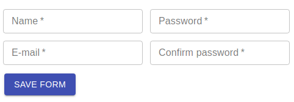

# jsonform

> Create material design form from a JSON object

[](https://www.npmjs.com/package/jsonform) [](https://standardjs.com)

## Dev Dependencies
* [Material-UI](https://material-ui.com/pt/)

## Install

```bash
npm install --save jsonform
```

## Basic Usage

```jsx
import React, { Component } from 'react'

import JsonForm from 'jsonform'

const formFields = {
  'name': {
    component: 'text',
    props: {
      label: 'Name',
      required: true
    }
  },
  'email': {
    component: 'text',
    props: {
      label: 'Email',
      required: true
    }    
  }
}

class MyClass extends Component {
  render() {
    return (
      <JsonForm 
        components={formFields}
        onSave={(data) => console.log(data)}
      />
    )
  }
}
```
## Popule form with remote data

```jsx
const formFields = {
  'user_name': {
    component: 'text',
    props: {
      label: 'Name',
      required: true
    }
  },
  'user_type': {
    component: 'select',
    props: {
      label: 'User Type',
      options: () => new Promise(resolve => {
        fetch('<rest api endpoint>')
          .then(res => res.json())
          .then(json => resolve(json.map(r => ({label: r.type, value: r.id}))
          .catch(resolve([]);
      })
    }
  }
}

// assume that the endpoint API returns something like: 
// { result: {user_id: 321, user_type: 123, user_name: 'Foo'} }
const fetchRemoteData = user => new Promise(resolve => {
  fetch(`<url endpoint>/${user}`)
    .then(res => res.json())
    .then(json => resolve({data: json.result}))
    .catch(() => resolve({}))
});

class MyClass extends Component {
  render() {
    return (
      <JsonForm 
        components={formFields}
        fetchData={fetchRemoteData}
        fetchParams={[321,]}
        onSave={(data) => console.log(data)}
      />
    )
  }
}
```

## Split form into columns


```jsx
const formFields = [{
  'user_name': {
    component: 'text',
    props: {
      label: 'Name',
      required: true
    }
  },
  'user_email': {
    component: 'text',
    props: {
      label: 'E-mail',
      required: true
    }
  },
}, {
  'user_password': {
    component: 'text',
    props: {
      label: 'Password',
      required: true,
      type: 'password'
    }
  },
  'user_repassword': {
    component: 'text',
    props: {
      label: 'Password',
      required: true,
      type: 'password'
    }
  }   
}]
```

## Custom components
```jsx

const MyComponent = ({...props}) => {
  const {id,value,onChange} = props;

  const _increment = () => {
    if(typeof onChange === 'function'){
      onChange({target: {name: id, value: value + 1}})
    }
  }

  return (
    <Button onClick={_increment}>Increment {value}</Button>
  )
}

const formFields = {
  'my_component': {
    component: MyComponent,
    props: { value: 1 }
  },
}
```

## Elements

* Text input
> props required: label
```jsx
'phone_number': {
  component: 'text',
  props: {
    label: 'Phone',
    required: true,
    value: "(123) 456 7899",
    validation: /\(?([0-9]{3})\)?([ .-]?)([0-9]{3})\2([0-9]{4})/,
    onKeyPress: (ev) => {  }
  }
}
```

* Input Select
> props required: label and options
```jsx
// fixed values
'user_level': {
  component: 'select',
  props: {
    label: 'User Level',
    required: true,
    options: [
      {value: 1, label: 'Admin'},
      {value: 2, label: 'Default'},
    ]
  }
}
```
```jsx
// fetch remote data options
// assume that the endpoint API returns something like: [{id: 123, label: 'Foo'},...]
'user_status': {
  component: 'select',
  props: {
    label: 'User Status',
    options: () => new Promise(resolve => {
      fetch('<rest api endpoint>')
        .then(res => res.json())
        .then(json => resolve(json.map(r => ({label: r.label, value: r.id}))
        .catch(resolve([]);
    })
  }
}
```
```jsx
// dependency
// fetch remote data based on value selected in other select
'user_profile': {
  component: 'select',
  props: {
    label: 'User Profile',
    depends: 'user_level',
    options: level => new Promise(resolve => {
      fetch(`<rest api endpoint>/${level}`)
        .then(res => res.json())
        .then(json => resolve(json.map(r => ({label: r.profile, value: r.id}))
        .catch(resolve([]);
    })
  }
}
```
* Switch
> props required: label
```jsx
  'user_is_master': {
    component: 'switch',
    props: {
      label: 'Master user',
      value: true,
      value_type: 'bool'
    }
  }
```
* File upload
> props required: label
```jsx
  'file_upload': {
    component: 'upload',
    props: {
      label: 'File Upload',
      info: 'CSV or XML file'
    }
  }
```

## Options

### Controls
```jsx
<JsonForm 
  components={formFields} 
  controlOptions={{
    saveText: 'Save Form',
    cancelText: 'Cancel'
  }}
  onSave={(data) => console.log(data)}
/>
```
### Skip a property in the model
```jsx
const formFields = {
  'name': {
    component: 'text',
    props: {
      label: 'Name',
      required: true
    }
  },
  'email': {
    component: 'text',
    props: {
      label: 'Email',
      required: true
    }    
  },
  'info': {
    component: 'info',
    props: {
      skip: true,
      text: 'Tip: Use a non commercial email.'
    }
  }  
}
```

## License

MIT © [Aderbal Nunes](https://github.com/aderbas)
